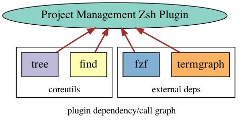

# zsh-bookmarks

> Quickly jump to your favourite projects on terminal

- [x] Quickly jump to your favourite projects without having to worry about `cd`ing into directories
- [x] browse through list and then select
- [x] If you reember the name, directly enter it to terminal

## How to Install

1. Either…

- Clone this repo
- add it as a submodule, or
- just download `pm.plugin.zsh`

2. Source `pm.plugin.zsh` in your '.zshrc'

### Integration

#### [oh-my-zsh](https://github.com/robbyrussell/oh-my-zsh)

Symlink (or copy) `pm.plugin.zsh` to `~/.oh-my-zsh/custom/ssh-agent.zsh`.

#### [antigen](https://github.com/zsh-users/antigen)

Update your `.zshrc` file with the following line:

```sh
antigen bundle avimehenwal/zsh-bookmarks
```

#### [antibody](https://github.com/getantibody/antibody)

Update your `.zshrc` file with the following line:

```sh
antibody bundle avimehenwal/zsh-bookmarks
```

#### [zplug](https://github.com/zplug/zplug)

Update your `.zshrc` file with the following line:

```sh
zplug "avimehenwal/zsh-bookmarks"
```

## How to use

1. [x] `pp` List projects and let user select
2. [x] Directly jumpt to project if you remember the name.
3. [x] `pa` Add new projects
4. [ ] Remove old projects



## ZSH Tricks

```zsh
man zshmodules
```

## Todo

- [ ] Make sure `data` file is removed before committing the repor

#### :v: Get in touch with me

> I am looking for Jobs ... :sunglasses:

- [Github](https://github.com/avimehenwal/)
- [My Website](https://avimehenwal.in)
- [My Blog v2](https://avimehenwal2.netlify.app/)
- [Twitter Handle](https://twitter.com/avimehenwal)
- [LinkedIn](https://in.linkedin.com/in/avimehenwal)
- [Stackoverflow](https://stackoverflow.com/users/1915935/avi-mehenwal)

<a href="https://www.buymeacoffee.com/F1j07cV" target="_blank"></a>

Spread Love :hearts: and not :no_entry_sign: hatred [](https://twitter.com/avimehenwal)
